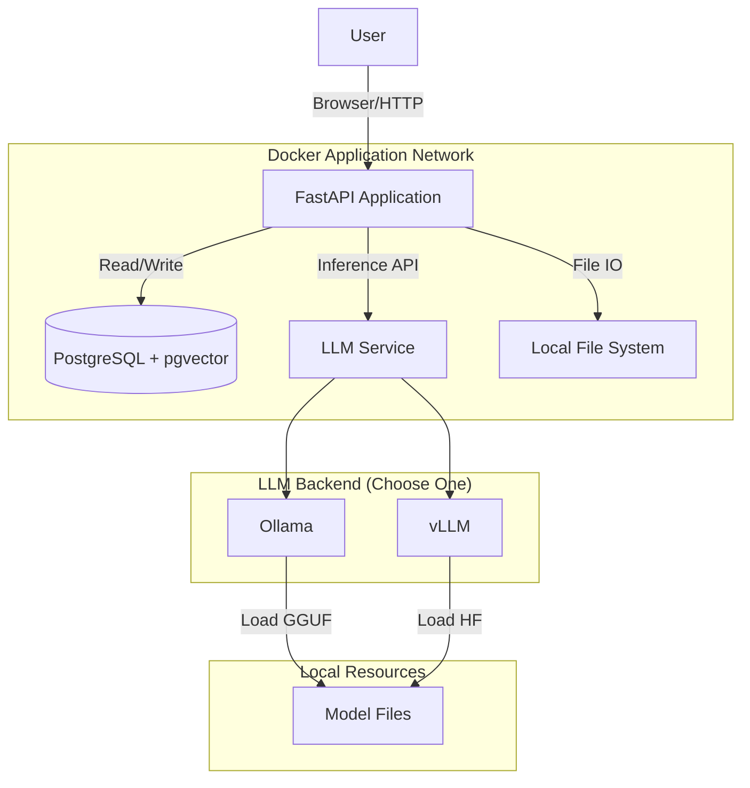
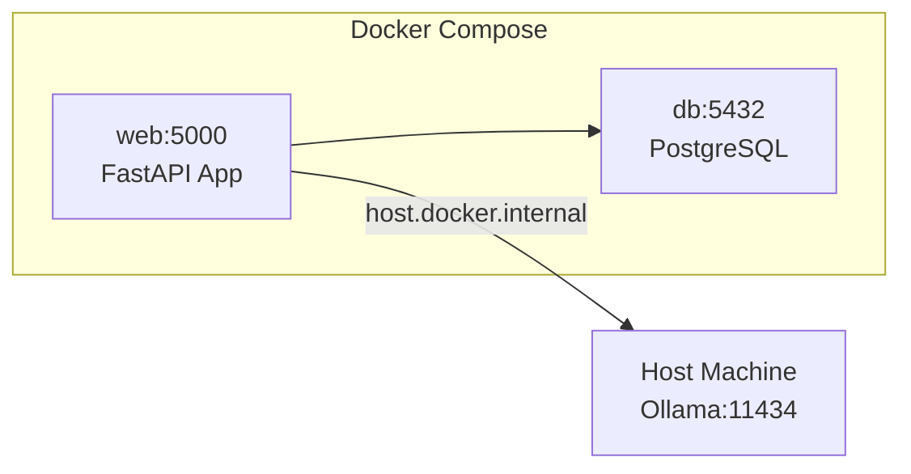

# Architecture Design Document

## 1. Introduction

The **Isolated AI Chatbot** is a secure, air-gapped capable conversational AI system designed to:
- Ingest and process private documents
- Provide RAG (Retrieval Augmented Generation) capabilities
- Run entirely on-premise without external API calls

---

## 2. System Overview

The system follows a containerized microservice architecture with three core components:

### 2.1 High-Level Architecture

---

## 3. Core Components

### 3.1 Web Application (Backend & Frontend)

| Attribute | Value |
|-----------|-------|
| **Framework** | FastAPI (Python 3.10+) |
| **Template Engine** | Jinja2 |
| **Frontend** | Vanilla JS/CSS (no build step) |

**Key Services:**

| Service | Responsibility |
|---------|---------------|
| `AuthService` | User authentication, session management, LDAP integration |
| `IngestionService` | Document parsing, chunking, embedding generation |
| `RAGService` | Vector search, hybrid retrieval, context assembly |
| `ChatService` | LLM interaction, streaming responses, chat history |
| `AdminService` | User/document management, system statistics |

### 3.2 Database

| Attribute | Value |
|-----------|-------|
| **Engine** | PostgreSQL 16 |
| **Extension** | pgvector (vector similarity search) |
| **ORM** | SQLModel (SQLAlchemy + Pydantic) |

**Stores:**
- User accounts and authentication data
- Chat sessions and message history
- Document metadata
- Document chunks with vector embeddings (768 dimensions)

### 3.3 Inference Engine

The system supports two LLM backends (configured via `LLM_PROVIDER`):

| Backend | Use Case | API Style |
|---------|----------|-----------|
| **Ollama** | Easy local deployment | Native Ollama API |
| **vLLM** | Production / high-throughput | OpenAI-compatible API |

Both backends handle:
- Text generation (chat completion)
- Embedding generation (for RAG)

---

## 4. Technology Stack

| Component | Technology | Rationale |
|-----------|------------|-----------|
| **Language** | Python 3.10+ | Extensive AI/ML ecosystem |
| **Web Framework** | FastAPI | Async support, auto-generated API docs |
| **ORM** | SQLModel | Type-safe, combines SQLAlchemy + Pydantic |
| **Database** | PostgreSQL + pgvector | Relational + vector search in one system |
| **LLM Runtime** | Ollama / vLLM | Flexible local inference options |
| **Document Parsing** | MarkItDown | Microsoft's robust Office/document converter |
| **Embeddings** | nomic-embed-text | High-quality 768-dim embeddings |
| **Frontend** | HTML5, Vanilla JS, CSS | Simple, no build step, easy to customize |

---

## 5. Deployment Architecture

### Docker Compose Setup

| Container | Purpose | Port |
|-----------|---------|------|
| `web` | Main application | 5000 |
| `db` | PostgreSQL + pgvector | 5432 |
| (Host) | Ollama service | 11434 |

### Volume Mounts
- `postgres_data`: Persistent database storage
- `./uploaded_files`: Document file storage

---

## 6. Security Considerations

The application implements multiple layers of security following OWASP best practices.

### 6.1 Security Headers

| Header | Value | Purpose |
|--------|-------|---------|
| `Content-Security-Policy` | `default-src 'self'...` | Prevents XSS and data injection |
| `X-Frame-Options` | `DENY` | Prevents clickjacking |
| `X-Content-Type-Options` | `nosniff` | Prevents MIME sniffing |
| `Referrer-Policy` | `strict-origin-when-cross-origin` | Controls referrer info |

### 6.2 Authentication & Session Management

| Aspect | Implementation |
|--------|----------------|
| **JWT Tokens** | Signed with configurable `SECRET_KEY` |
| **Cookie Security** | `HttpOnly`, `SameSite=Lax`, `Secure` (in production) |
| **Password Storage** | Bcrypt hashing with automatic salt |
| **LDAP Support** | Optional enterprise directory integration |

### 6.3 CSRF Protection

- **Primary Defense**: `SameSite=Lax` cookies prevent cross-site form submissions
- **AJAX Defense**: `X-CSRF-Token` header validation for DELETE/PUT requests
- **Token Signing**: HMAC-signed tokens with expiry

### 6.4 Rate Limiting

| Endpoint | Limit | Purpose |
|----------|-------|---------|
| `/login` | 5/min/IP | Brute force prevention |
| `/chat` | 60/min/user | API abuse prevention |
| `/admin/files/upload` | 10/min/user | Upload abuse prevention |

### 6.5 Additional Protections

| Aspect | Implementation |
|--------|----------------|
| **Air-Gapped Design** | No external API calls for inference or processing |
| **Path Traversal** | File downloads validated against upload directory |
| **Input Validation** | Pydantic models for all API inputs |
| **SQL Injection** | SQLModel ORM with parameterized queries |

---

## 7. Scalability Notes

- **Single Instance**: Current design is single-node
- **Database**: PostgreSQL can be scaled independently
- **LLM Inference**: Can be offloaded to dedicated GPU servers via vLLM
- **Horizontal Scaling**: Would require session store migration (Redis)
