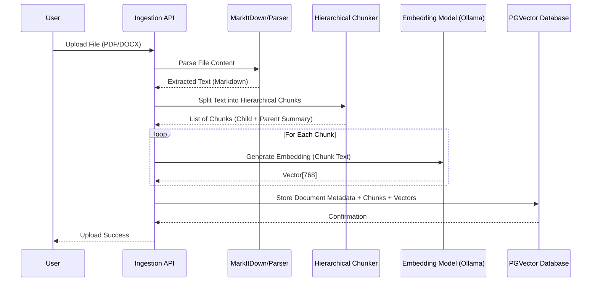
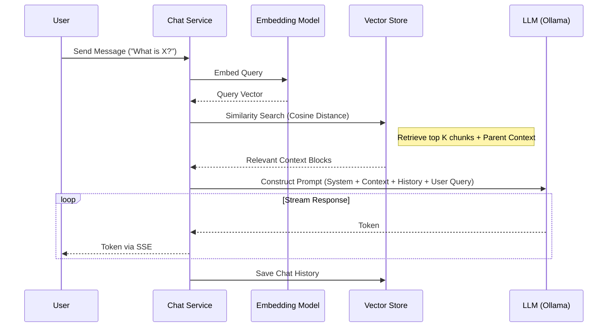

# Data Flow Documentation

## 1. Document Ingestion Pipeline
This pipeline describes how raw files are transformed into searchable vector embeddings.

### Process Details
1. **Upload**: User sends a file via the web interface.
2. **Parsing**: 
   - `MarkItDown` is used to convert binary formats (PDF, DOCX) into clean text/markdown.
   - Text is cleaned to remove artifacts.
3. **Chunking**:
   - **Hierarchical Chunking**: The text is split into larger logical blocks (Parents) and smaller retrieval units (Children).
   - Summaries are generated for parent blocks to enhance context.
4. **Embedding**:
   - Each chunk's content is sent to the local embedding model (e.g., `nomic-embed-text`).
   - A 768-dimensional vector is returned.
5. **Storage**:
   - The original text, the hierarchical relationships (ParentID), and the vectors are stored in the `DocumentChunk` table.

## 2. RAG Retrieval & Chat Pipeline
This pipeline describes how a user question is answered using the knowledge base.

### Process Details
1. **Query Embedding**: The user's message is converted into the same vector space as the documents.
2. **Vector Search**: The system queries the `DocumentChunk` table for vectors with the smallest cosine distance to the query vector.
3. **Context Assembly**: 
   - Retrieved chunks are assembled. 
   - If hierarchical chunking is active, parent summaries may be included to provide broader context.
4. **Prompt Engineering**:
   - A strict System Prompt instructs the LLM to use *only* the provided context.
   - The Context and recent Chat History are combined with the user's query.
5. **Generation**: The LLM generates the response, which is streamed back to the user in real-time.
