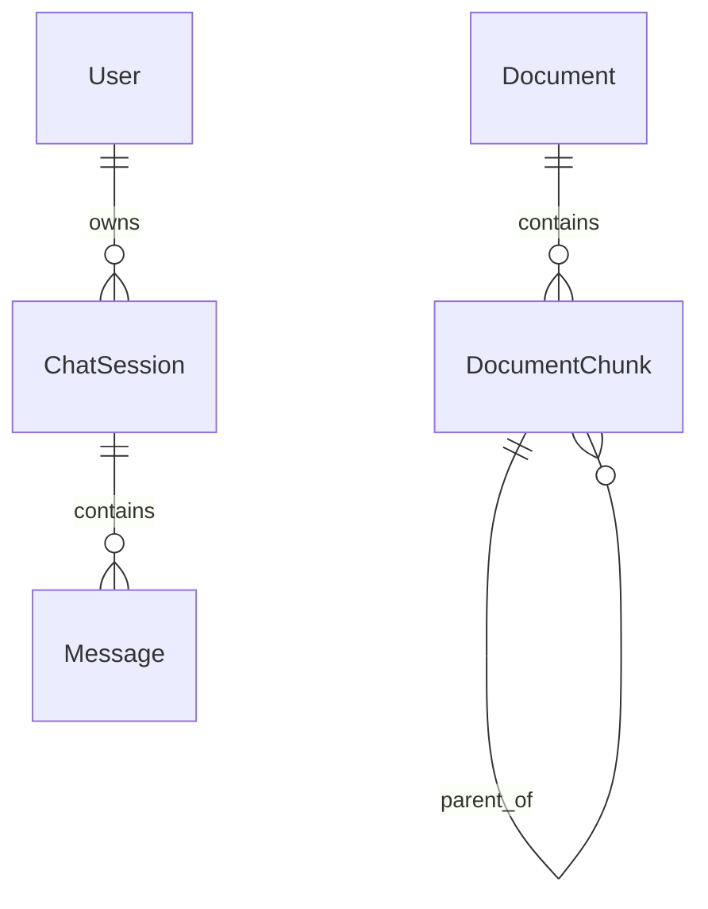

# Detailed Design Document

This document covers database schema and API specifications.

---

## 1. Database Design

The application uses **PostgreSQL 16** with the **pgvector** extension for vector similarity search. The ORM is **SQLModel** (SQLAlchemy + Pydantic).

### 1.1 Entity Relationship Diagram



---

### 1.2 Tables

#### `user`

| Column | Type | Constraints | Description |
|--------|------|-------------|-------------|
| `id` | Integer | PK, Auto | Primary key |
| `username` | String | Unique, Index | Login username |
| `email` | String | Nullable | User email address |
| `hashed_password` | String | Required | Bcrypt hash or LDAP placeholder |
| `is_active` | Boolean | Default: True | Account activation status |
| `is_admin` | Boolean | Default: False | Admin privileges flag |
| `created_at` | DateTime | Default: Now | Account creation timestamp |

---

#### `chatsession`

| Column | Type | Constraints | Description |
|--------|------|-------------|-------------|
| `id` | Integer | PK, Auto | Primary key |
| `user_id` | Integer | FK → user.id | Session owner |
| `name` | String | Default: "New Chat" | Display name for the session |
| `created_at` | DateTime | Default: Now | Session creation timestamp |

---

#### `message`

| Column | Type | Constraints | Description |
|--------|------|-------------|-------------|
| `id` | Integer | PK, Auto | Primary key |
| `session_id` | Integer | FK → chatsession.id | Parent session |
| `role` | String | Required | `user` or `assistant` |
| `content` | Text | Required | Message body |
| `citations` | Text | Nullable | HTML of source citations |
| `created_at` | DateTime | Default: Now | Message timestamp |

---

#### `document`

| Column | Type | Constraints | Description |
|--------|------|-------------|-------------|
| `id` | Integer | PK, Auto | Primary key |
| `filename` | String | Required | Original filename |
| `file_type` | String | Required | MIME type or extension |
| `uploaded_at` | DateTime | Default: Now | Upload timestamp |

---

#### `documentchunk`

| Column | Type | Constraints | Description |
|--------|------|-------------|-------------|
| `id` | Integer | PK, Auto | Primary key |
| `document_id` | Integer | FK → document.id | Parent document |
| `content` | Text | Required | Chunk text content |
| `page_number` | Integer | Nullable | Source page (if available) |
| `embedding` | Vector(768) | Required | pgvector embedding |
| `parent_id` | Integer | FK → documentchunk.id, CASCADE | Hierarchical parent chunk |
| `is_summary` | Boolean | Default: False | True if this is a summary chunk |

> **Note**: The `parent_id` foreign key has `ON DELETE CASCADE` to automatically clean up child chunks when a parent is deleted.

---

## 2. API Design

The API is built with **FastAPI** and serves both HTML pages and JSON endpoints.

### 2.1 Authentication (`/auth`)

| Method | Endpoint | Description |
|--------|----------|-------------|
| GET | `/login` | Login page (HTML) |
| POST | `/login` | Authenticate user, set JWT cookie |
| GET | `/logout` | Clear session, redirect to login |

---

### 2.2 Chat (`/chat`)

| Method | Endpoint | Description |
|--------|----------|-------------|
| GET | `/` | Main chat interface (HTML) |
| POST | `/chat` | Send message, receive streaming response (SSE) |
| POST | `/chat/new` | Create new chat session |
| PUT | `/chat/{session_id}` | Rename chat session |
| DELETE | `/chat/{session_id}` | Delete chat session |

---

### 2.3 Documents

| Method | Endpoint | Description |
|--------|----------|-------------|
| GET | `/documents/{id}/download` | Download original document file |

---

### 2.4 Admin (`/admin`)

> **Note**: All admin endpoints require admin privileges.

| Method | Endpoint | Description |
|--------|----------|-------------|
| GET | `/admin/dashboard` | Dashboard with statistics (HTML) |
| GET | `/admin/users` | User management page (HTML) |
| POST | `/admin/users/create` | Create local user |
| POST | `/admin/users/create-ldap` | Create LDAP user |
| DELETE | `/admin/users/{id}` | Delete user |
| POST | `/admin/users/{id}/reset-password` | Reset user password |
| POST | `/admin/users/{id}/update-email` | Update user email |
| POST | `/admin/users/{id}/update` | Update user (email, admin status) |
| POST | `/admin/users/{id}/set-ldap` | Convert to LDAP-only auth |
| GET | `/admin/files` | File management page (HTML) |
| POST | `/admin/files/upload` | Upload and index files |
| GET | `/admin/files/{id}/download` | Download document |
| GET | `/admin/files/{id}/inspect` | View document chunks (HTML) |
| DELETE | `/admin/files/{id}` | Delete document |
| DELETE | `/admin/files/reset/all` | Delete all documents |
| GET | `/admin/tools/convert` | Markdown conversion tool (HTML) |
| POST | `/admin/tools/convert` | Convert file to markdown |

---

## 3. Streaming Protocol

The `/chat` endpoint returns a streaming response (NDJSON format):

| Event Type | Payload | Description |
|------------|---------|-------------|
| `user_html` | `{html: "..."}` | Rendered user message HTML |
| `ai_start` | `{}` | AI is starting to respond |
| `token` | `{content: "..."}` | Single token of AI response |
| `sources` | `{html: "..."}` | Source citations HTML (Policy mode) |
| `done` | `{sessionId: N}` | Response complete |

Example stream:
```json
{"type": "user_html", "html": "<div class=\"message-wrapper\">..."}
{"type": "ai_start"}
{"type": "token", "content": "The"}
{"type": "token", "content": " answer"}
{"type": "token", "content": " is..."}
{"type": "sources", "html": "<div class=\"sources-container\">..."}
{"type": "done", "sessionId": 42}
```
